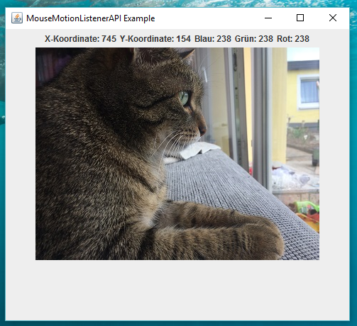

# Demo of the MouseMoveExample

(yes, this is my cat)

# Windows:
Download the Source and run the "Start.bat" Bootstrapper File in the src/Windows folder.

ToDo:
-Lots of things
-fixing bugs
-Writing Bootstrapper for Linux/macOS
(for now, use "java -jar Main.jar" for start, be sure to take care of default.png)
-cleaning up

## Screenshot
</img>
